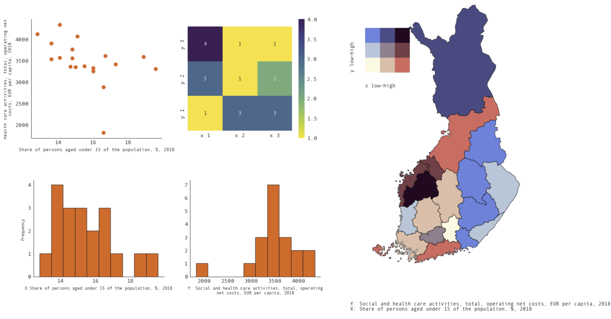
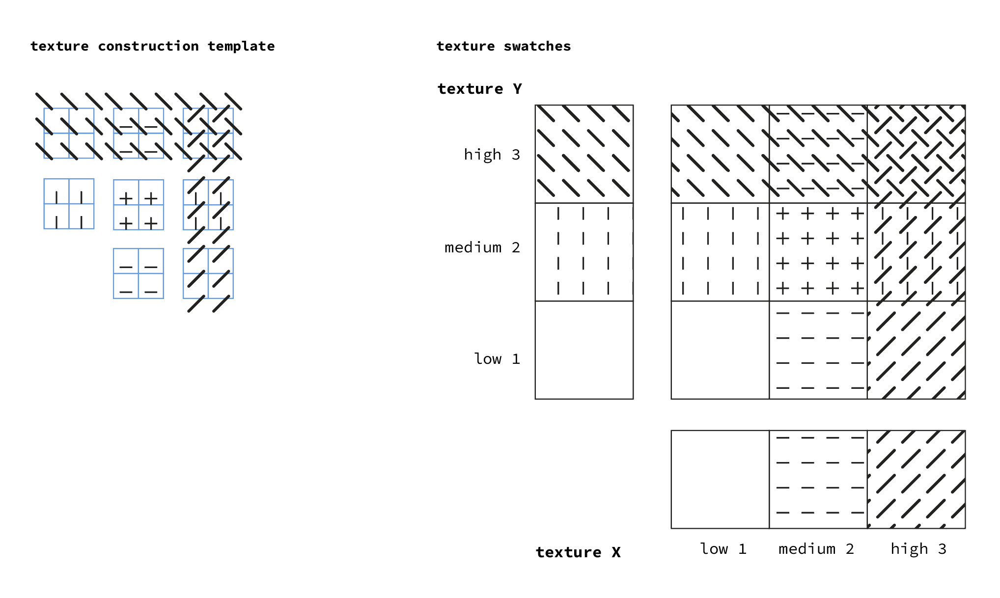
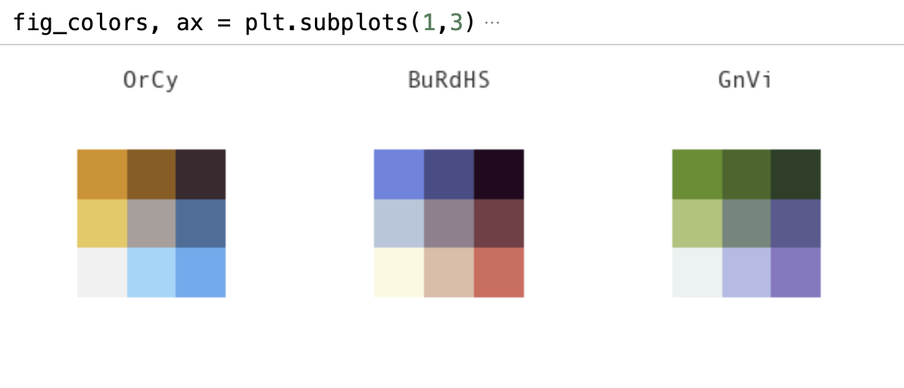

# Bivariate-dataprocess
Notebook and supplementary materials for Master’s thesis

## Map generation

The Jupyter Notebook `bivariate_dataprocess-and-map-export.ipynb` can be used to generate the contingency tables, scatterplots, histograms and bivariate maps in the Master’s thesis. Additional visualizations can be made from the included data sets.

The notebook uses Pandas v. 1.5.1, Seaborn v. 0.11.2, Numpy v. 1.23.4 and Matplotlib v. 3.6.1 but may work with other versions. 

Geoprocessing is done using geopandas v. 0.12.0 and fiona v. 1.8.22. 

Used data © Statistics Finland (CC BY 4.0)
- Municipial and regional statistics: Municipal key figures 1987-2018 https://pxdata.stat.fi/PxWeb/pxweb/en/Kuntien_avainluvut/Kuntien_avainluvut__2019/kuntien_avainluvut_2019_aikasarja.px/
- Geodata, municipalities: https://stat.fi/org/avoindata/paikkatietoaineistot/kuntapohjaiset_tilastointialueet_en.html
- Geodata, regions: https://stat.fi/org/avoindata/paikkatietoaineistot/kuntapohjaiset_tilastointialueet_en.html

## Textures

The Adobe Illustrator 2020 document `bivariate-textures.ai`contains texture (pattern) swatches and the model used for texture design plus example images. 

## Color palettes

The hex codes and summary statistics for the 3 x 3 color palettes are also collected in 
`bivariate-colortables.csv`.
Colors as hex codes listed starting from light 1-1 swatch.
Delta E values refer to differences between palette colors.
Color vision deficiency (CVD) safe calculated using 6 as minimum acceptable Delta E value 